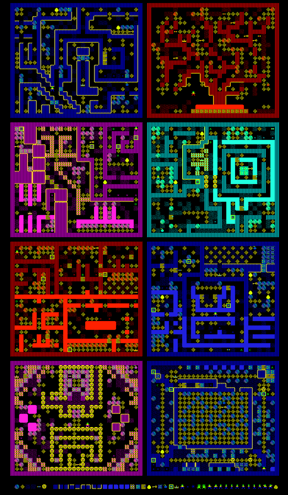

# repton-datafile-render

This scripts in this repository produce maps and sprite charts from data files generated by the BBC Micro, Acorn Electron, and Commodore 64 versions of Repton 3 and Repton Infinity (published by Superior Software in the 1980s).

This script is compatible with all types of data file generated by:

* Repton 3 / Acorn Electron
* Repton 3 / BBC Micro
* Repton 3 / Commodore 64
* Repton Infinity / Acorn Electron
* Repton Infinity / BBC Micro

### `render_repton_maps.py`

Render maps and sprite charts from data files generated by the BBC Micro, Acorn Electron, and Commodore 64 versions of Repton 3 and Repton Infinity - including Repton Infinity's G, M, S, E data files.

### `render_reptol_scripts.py`

Produce listings of Blueprint files (T or eT files) generated by the Electron and BBC Micro versions of Repton Infinity. The language used by Repton Infinity was called Reptol.

### Example output

---

## Author

This code was developed by Dominic Ford <https://dcford.org.uk>. It is distributed under the Gnu General Public License V3.
